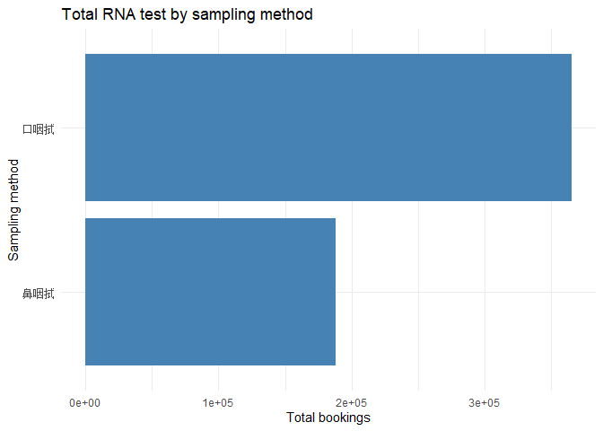
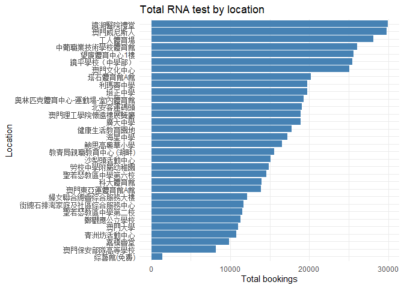
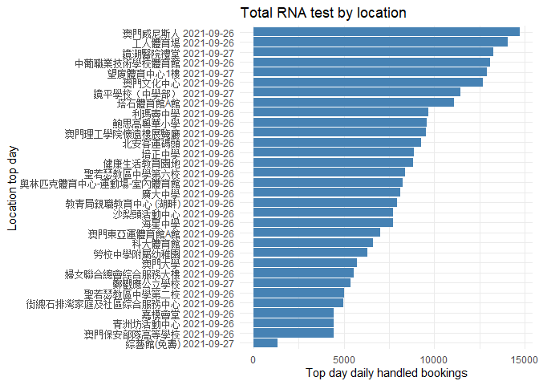

## 關於  

它是21年九月份的澳門第二次全民核酸的一些個人分析，數據來源分別是  
  
1. 核酸檢測站  
[https://eservice.ssm.gov.mo/aptmon/aptmon/ch]  
來源即時刷新，主要取用採樣點數目參考  

2. 網上預約全民核酸檢測人次  
[https://www.ssm.gov.mo/docs/stat/apt/RNA010.xlsx]  
因來源聲明“截至執行時間為止仍然有效的網上預約全民核酸檢測人次統計”，這裡的分析且作歷史事實  

## 核酸採樣點的數據準備

1. 抓取頁面容器內的表標記，數據截取自第二和第三日早晚的四次不同時間  


```r
scrp1 <- read.csv("aptmon-scraping/station-20210926202025.csv", na = "---")
scrp2 <- read.csv("aptmon-scraping/station-20210926230837.csv", na = "---")
scrp3 <- read.csv("aptmon-scraping/station-20210927093840.csv", na = "---")
scrp4 <- read.csv("aptmon-scraping/station-20210927195730.csv", na = "---")

scrp1$DateTime <- as.POSIXct(strptime("20210926202025","%Y%m%d%H%M%S"))
scrp2$DateTime <- as.POSIXct(strptime("20210926230837","%Y%m%d%H%M%S"))
scrp3$DateTime <- as.POSIXct(strptime("20210927093840","%Y%m%d%H%M%S"))
scrp4$DateTime <- as.POSIXct(strptime("20210927195730","%Y%m%d%H%M%S"))

scrp <- rbind(scrp1,scrp2,scrp3,scrp4)
```

2. 對地點作簡化處理，採樣點數取四次的均值，轉化地點信息  


```r
station <- scrp %>% group_by(序號,地點,類別) %>%
      summarise(
            口採樣點.mean = mean(口採樣點, na.rm = TRUE),
            鼻採樣點.mean = mean(鼻採樣點, na.rm = TRUE)
      ) %>% as.data.frame()

colnames(station)[which(names(station) == "地點")] <- "Location"
station %>% top_n(10)
```

```
##    序號                 Location 類別 口採樣點.mean 鼻採樣點.mean
## 1   A05             澳門坊眾學校    A          3.25          3.25
## 2   B03           鄭觀應公立學校    B          2.00          3.00
## 3   B04               工人體育場    B          5.00          4.75
## 4   B05       鏡平學校（中學部）    B          4.75          4.50
## 5   B09          望廈體育中心1樓    B          4.00          6.50
## 6   B13             鏡湖醫院禮堂    B          4.00          3.75
## 7   B15                 培正中學    B          3.75          3.00
## 8   B17 澳門理工學院懷遠樓展覽廳    B          4.00          3.75
## 9   B18             澳門文化中心    B          4.50          4.50
## 10  B19               利瑪竇中學    B          3.50          3.50
## 11  B29             澳門威尼斯人    B          7.00          3.25
```

3. 下載預約歷史 xlsx，在獨立頁面上分別抽取四日信息  

- 因頁面當前已經結束且無法下載，預讀取的 xlsx 是取用於全民核酸最後一日結束前六小時的記錄  

```r
# download.file('https://www.ssm.gov.mo/docs/stat/apt/RNA010.xlsx', 'RNA010.xlsx', method='curl' )
```

- 讀取Excel內分頁其一天，重复四次读取  

```r
### Extract first row for location list
cnames <- read_excel("RNA010-0928934.xlsx", sheet="20210925A", n_max = 0, na = "---") %>% names()
lls1 <- cnames[seq(6, length(cnames), 3)]
### Extract data from 2nd row 
rdf1 <- read_excel("RNA010-0928934.xlsx", sheet="20210925A", na = "---", skip = 2) #skip 2 because there exists a hidden row 1 in this spreadsheet
sdf1 <- rdf1 %>% select(c(1:2,6:ncol(rdf1))) %>% slice(2:nrow(rdf1)) %>% select(-contains("總人次"))
### Repeat Location info for number of rows
Location <- rep(lls1, each = nrow(sdf1) * 2)
### Set date
sdf1$預約日期 <- as.Date("2021-09-25")
### Melt to pivot
sdf1 <- as.data.frame(sdf1)
mdf1 <- reshape::melt(sdf1, id = c("預約日期", "預約時段"))
### Combine Location with dataset
df1 <- cbind(Location,mdf1)
### Clean away column names with ...
df1$variable <- sub("\\....*", "", df1$variable)
```


3. 合併作一個數據集，添加時間處理  


```r
df <- rbind(df1,df2,df3,df4)
head(df)
```

```
##                 Location   預約日期    預約時段 variable value
## 1 中葡職業技術學校體育館 2021-09-25 15:00-15:30   口咽拭   142
## 2 中葡職業技術學校體育館 2021-09-25 15:30-16:00   口咽拭   162
## 3 中葡職業技術學校體育館 2021-09-25 16:00-16:30   口咽拭   148
## 4 中葡職業技術學校體育館 2021-09-25 16:30-17:00   口咽拭   145
## 5 中葡職業技術學校體育館 2021-09-25 17:00-17:30   口咽拭   140
## 6 中葡職業技術學校體育館 2021-09-25 17:30-18:00   口咽拭   167
```

```r
df$ReservationDateTime <- as.POSIXlt(paste(df$預約日期, substr(df$預約時段,1,5)))
df$ReservationCalendarTime <- as.POSIXct(paste(df$預約日期, substr(df$預約時段,1,5)))
df$ReservationTime <- 
sapply(strsplit(substr(df$預約時段,1,5),":"),
  function(x) {
    x <- as.numeric(x)
    x[1]+x[2]/60
    }
)
```


## 數據整合  

1. 合併採樣點及預約歷史，除均值既得每個採樣點的平均採樣處理數  


```r
mdf <- merge(station[1:5], df, by = "Location")
mdf$ReservationPerStation <- ifelse(
      mdf$variable == "口咽拭",
      mdf$value/mdf$口採樣點.mean,
      mdf$value/mdf$鼻採樣點.mean
      )
head(mdf)
```

```
##                             Location 序號 類別 口採樣點.mean 鼻採樣點.mean
## 1 奧林匹克體育中心-運動場-室內體育館  B22    B          4.25           1.5
## 2 奧林匹克體育中心-運動場-室內體育館  B22    B          4.25           1.5
## 3 奧林匹克體育中心-運動場-室內體育館  B22    B          4.25           1.5
## 4 奧林匹克體育中心-運動場-室內體育館  B22    B          4.25           1.5
## 5 奧林匹克體育中心-運動場-室內體育館  B22    B          4.25           1.5
## 6 奧林匹克體育中心-運動場-室內體育館  B22    B          4.25           1.5
##     預約日期    預約時段 variable value ReservationDateTime
## 1 2021-09-26 14:00-14:30   鼻咽拭    86 2021-09-26 14:00:00
## 2 2021-09-28 09:00-09:30   鼻咽拭    29 2021-09-28 09:00:00
## 3 2021-09-27 00:30-01:00   口咽拭   149 2021-09-27 00:30:00
## 4 2021-09-28 02:00-02:30   口咽拭     8 2021-09-28 02:00:00
## 5 2021-09-28 08:30-09:00   鼻咽拭    13 2021-09-28 08:30:00
## 6 2021-09-28 01:00-01:30   口咽拭     9 2021-09-28 01:00:00
##   ReservationCalendarTime ReservationTime ReservationPerStation
## 1     2021-09-26 14:00:00            14.0             57.333333
## 2     2021-09-28 09:00:00             9.0             19.333333
## 3     2021-09-27 00:30:00             0.5             35.058824
## 4     2021-09-28 02:00:00             2.0              1.882353
## 5     2021-09-28 08:30:00             8.5              8.666667
## 6     2021-09-28 01:00:00             1.0              2.117647
```

## 初步分析  

1. 截至結束前六小時，總預約數  

```r
sum(mdf$value,na.rm = TRUE)
```

```
## [1] 553350
```

2. 口咽拭約為鼻咽拭的兩倍  

```r
p1 <- mdf %>% group_by(variable) %>% summarise(value.sum = sum(value, na.rm = TRUE))

ggplot(data=p1, aes(x = variable, y = value.sum)) +
  geom_bar(stat="identity", fill="steelblue") + coord_flip() +
  theme_minimal() +
  ggtitle("Total RNA test by sampling method") + xlab("Sampling method") + ylab("Total bookings")
```

<!-- -->

3. 預約總數的採樣點排名  

```r
p2 <- mdf %>% group_by(Location) %>% tally(value)

ggplot(data=p2, mapping = aes(x = reorder(Location,n), n)) +
  geom_bar(stat="identity", fill="steelblue") + coord_flip() +
  theme_minimal() +
  ggtitle("Total RNA test by location") + xlab("Location") + ylab("Total bookings")
```

<!-- -->

4. 四日內預約情況看，高峰集中在第二日  

```r
p3 <- mdf %>% group_by(ReservationTime,預約日期) %>% summarise(value.sum = sum(value, na.rm = TRUE))

ggplot(p3,aes(x = ReservationTime, y = value.sum, color = value.sum)) +
geom_line() + facet_grid(預約日期~. )
```

<!-- -->

5. 預約單日的排名  

```r
p4 <- mdf %>% group_by(Location,預約日期) %>% tally(value) %>% top_n(1) %>% as.data.frame()

ggplot(data=p4, mapping = aes(x = reorder(paste(Location,預約日期),n), n)) +
  geom_bar(stat="identity", fill="steelblue") + coord_flip() +
  theme_minimal() +
  ggtitle("Total RNA test by location") + xlab("Location top day") + ylab("Top day daily handled bookings")
```

<!-- -->

6. 澳門威尼斯人及工人體育館排名前


```r
p5 <- filter(mdf, Location %in% c("澳門威尼斯人","工人體育館")) %>%
      group_by(Location,ReservationCalendarTime,variable) %>%
      summarise(value.sum = sum(value, na.rm = TRUE))
```

```
## `summarise()` has grouped output by 'Location', 'ReservationCalendarTime'. You can override using the `.groups` argument.
```

```r
ggplot(p5,aes(x = ReservationCalendarTime, y = value.sum)) +
geom_line(stat = "identity", aes(color = variable)) +
#facet_wrap(~Location, nrow = 8, ncol = 4) +
facet_grid(Location~.) +
ggtitle("RNA test per sampling method by location") + xlab("All intervals") + ylab("Total test")
```

<!-- -->

7. 每站點24小時日間均值，低數值表示負荷壓力小，澳門威尼斯人測試站預約總數高，每半小時測試均值 20-40，較為快速   


```r
p6 <- filter(mdf, Location %in% c("澳門威尼斯人","工人體育館")) %>%
      group_by(Location,ReservationTime,variable) %>%
      summarise(value.mean = mean(ReservationPerStation, na.rm = TRUE))
```

```
## `summarise()` has grouped output by 'Location', 'ReservationTime'. You can override using the `.groups` argument.
```

```r
ggplot(p6,aes(x = ReservationTime, y = value.mean)) +
geom_line(stat = "identity", aes(color = variable)) +
#facet_wrap(~Location, nrow = 8, ncol = 4) +
facet_grid(Location~.) +
ggtitle("RNA test per sampling method by location") + xlab("24 hours") + ylab("Average test per station")
```

<!-- -->
