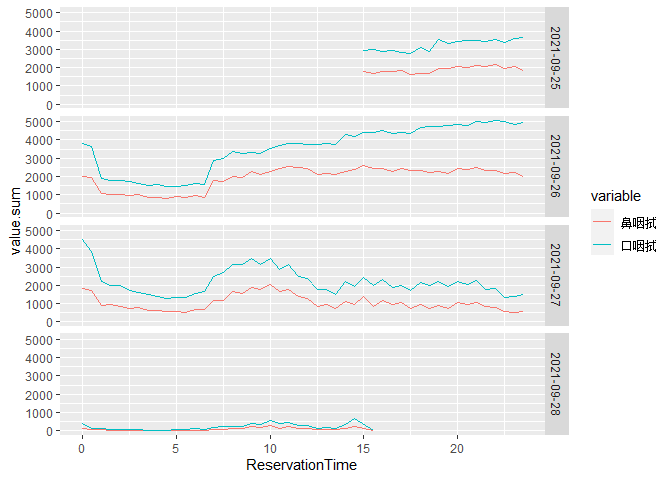
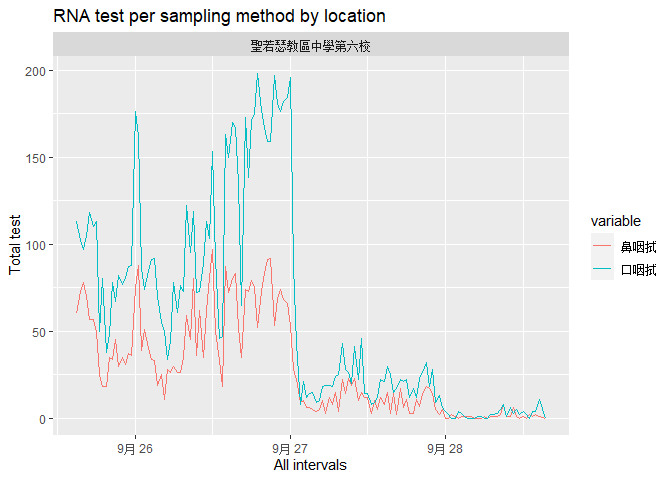
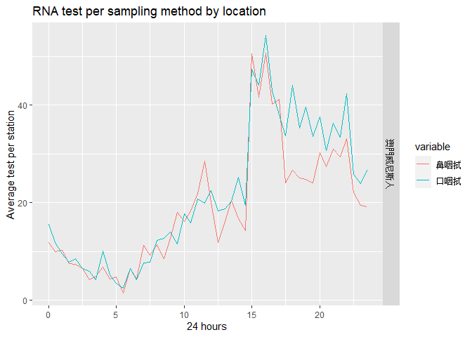

## 關於  

這是2021年九月澳門第二次全民核酸的一些個人分析，數據來源分別是  
  
1. [核酸檢測站](https://eservice.ssm.gov.mo/aptmon/aptmon/ch)  
來源即時刷新，主要取用採樣點數目參考  

2. [網上預約全民核酸檢測人次](https://www.ssm.gov.mo/docs/stat/apt/RNA010.xlsx)  
因來源聲明“截至執行時間為止仍然有效的網上預約全民核酸檢測人次統計”，這裡的分析且作歷史事實  

## 採樣點數據準備

1. Rselenimu 採集頁面容器內的表標記，對地點作簡化處理  


```r
mybrowser <- rsDriver(browser = 'firefox', verbose = TRUE, port=4545L,)
```


```r
link <- "https://eservice.ssm.gov.mo/aptmon/aptmon/ch"
mybrowser$client$navigate(link)

#mybrowser$client$findElement(using = 'id', "tblist")$getElementText()
html.table.0 <-  mybrowser$client$findElement(using = 'id', "tblist")
webElem5txt.0 <- html.table.0$getElementAttribute("outerHTML")[[1]]

#read_html(webElem5txt.0) %>% html_nodes('div.hidden-xs') %>% html_text(trim = TRUE)
df.table.0 <-  read_html(webElem5txt.0) %>% html_table() %>% data.frame(.)
df.table.0$地點 <- read_html(webElem5txt.0) %>% html_nodes('div.hidden-xs') %>% html_text(trim = TRUE)
station <- df.table.0[,c(1:4,7)]
station
```

```
##    序號                               地點 口採樣點 鼻採樣點 類別
## 1   A01         街坊會聯合總會社區服務大樓        2        2    A
## 2   A02                           慈幼中學        1        1    A
## 3   A03                   望廈體育中心三樓        1        1    A
## 4   A04                      塔石體育館B館        1        1    A
## 5   A05                       澳門坊眾學校        3        3    A
## 6   A06     奧林匹克體育中心運動場乒乓球室        1        0    A
## 7   A07                     石排灣公立學校        1        0    A
## 8   B01               聖若瑟教區中學第六校        2        2    B
## 9   B02                     青洲坊活動中心        2        2    B
## 10  B03                     鄭觀應公立學校        2        3    B
## 11  B04                         工人體育場        7        7    B
## 12  B05                 鏡平學校（中學部）        5        6    B
## 13  B06             中葡職業技術學校體育館        6        3    B
## 14  B07                   健康生活教育園地        4        2    B
## 15  B08                     鮑思高粵華小學        2        3    B
## 16  B09                    望廈體育中心1樓        4        7    B
## 17  B10                           廣大中學        4        2    B
## 18  B11                 勞校中學附屬幼稚園        3        2    B
## 19  B12           婦女聯合總會綜合服務大樓        1        2    B
## 20  B13                       鏡湖醫院禮堂        4        4    B
## 21  B14                     沙梨頭活動中心        4        3    B
## 22  B15                           培正中學        4        3    B
## 23  B16                      塔石體育館A館        4        2    B
## 24  B17           澳門理工學院懷遠樓展覽廳        4        4    B
## 25  B18                       澳門文化中心        4        5    B
## 26  B19                         利瑪竇中學        4        4    B
## 27  B20               聖若瑟教區中學第二校        1        2    B
## 28  B21                           海星中學        5        2    B
## 29  B22 奧林匹克體育中心-運動場-室內體育館        3        2    B
## 30  B23                           嘉模會堂        2        1    B
## 31  B24                       北安客運碼頭        2        0    B
## 32  B25          教青局親職教育中心 (湖畔)        4        4    B
## 33  B26               澳門保安部隊高等學校        2        2    B
## 34  B27   街總石排灣家庭及社區綜合服務中心        4        2    B
## 35  B28                           澳門大學        1        2    B
## 36  B29                       澳門威尼斯人        6        3    B
## 37  B30                澳門東亞運體育館A館        3        3    B
## 38  B31                         科大體育館        2        2    B
## 39  C01                             綜藝館        1        1    C
## 40  C02               國檢（澳門）醫務中心        2        2    C
## 41  C03                         金沙娛樂場        1        0    C
## 42  C04                         新葡京酒店        1        0    C
## 43  C05                             美高梅        1        0    C
## 44  C06                           永利澳門        1        0    C
## 45  C07                           星際酒店        1        0    C
## 46  C08                       澳門國際機場        0        0    C
## 47  C09                       澳門科大醫院        1        1    C
## 48  C10                           永利皇宮        1        0    C
## 49  C11                         美獅美高梅        1        0    C
## 50  C12                           新濠影匯        1        0    C
## 51  C13                         百老匯酒店        1        0    C
## 52  C14                       南粵橫琴口岸        1        1    C
```

2. 下載 xlsx，在獨立頁面上分別抽取四日信息  


```r
download.file('https://www.ssm.gov.mo/docs/stat/apt/RNA010.xlsx', 'RNA010.xlsx', method='curl' )
```

- **Sept 25**   需要留意該頁第一行為隱藏行  

```r
### Extract first row for location list
cnames <- read_excel("RNA010.xlsx", sheet="20210925A", n_max = 0, na = "---") %>% names()
lls1 <- cnames[seq(6, length(cnames), 3)]
### Extract data from 2nd row 
rdf1 <- read_excel("RNA010.xlsx", sheet="20210925A", na = "---", skip = 2) #skip 2 because there exists a hidden row 1 in this spreadsheet
sdf1 <- rdf1 %>% select(c(1:2,6:ncol(rdf1))) %>% slice(2:nrow(rdf1)) %>% select(-contains("總人次"))
### Repeat Location info for number of rows
Location <- rep(lls1, each = nrow(sdf1) * 2)
### Set date
sdf1$預約日期 <- as.Date("2021-09-25")
### Melt to pivot
sdf1 <- as.data.frame(sdf1)
mdf1 <- melt(sdf1, id = c("預約日期", "預約時段"))
### Combine Location with dataset
df1 <- cbind(Location,mdf1)
### Clean away column names with ...
df1$variable <- sub("\\....*", "", df1$variable)
```

- **Sept 26**  

```r
### Extract first row for location list
cnames <- read_excel("RNA010.xlsx", sheet="20210926A", n_max = 0, na = "---") %>% names()
lls2 <- cnames[seq(6, length(cnames), 3)]
### Extract data from 2nd row 
rdf2 <- read_excel("RNA010.xlsx", sheet="20210926A", na = "---", skip = 1)
sdf2 <- rdf2 %>% select(c(1:2,6:ncol(rdf2))) %>% slice(2:nrow(rdf2)) %>% select(-contains("總人次"))
### Repeat Location info for number of rows
Location <- rep(lls2, each = nrow(sdf2) * 2)
### Set date
sdf2$預約日期 <- as.Date("2021-09-26")
### Melt to pivot
sdf2 <- as.data.frame(sdf2)
mdf2 <- melt(sdf2, id = c("預約日期", "預約時段"))
### Combine Location with dataset
df2 <- cbind(Location,mdf2)
### Clean away column names with ...
df2$variable <- sub("\\....*", "", df2$variable)
```

- **Sept 27**  

```r
### Extract first row for location list
cnames <- read_excel("RNA010.xlsx", sheet="20210927A", n_max = 0, na = "---") %>% names()
lls3 <- cnames[seq(6, length(cnames), 3)]
### Extract data from 2nd row 
rdf3 <- read_excel("RNA010.xlsx", sheet="20210927A", na = "---", skip = 1)
sdf3 <- rdf3 %>% select(c(1:2,6:ncol(rdf3))) %>% slice(2:nrow(rdf3)) %>% select(-contains("總人次"))
### Repeat Location info for number of rows
Location <- rep(lls3, each = nrow(sdf3) * 2)
### Set date
sdf3$預約日期 <- as.Date("2021-09-27")
### Melt to pivot
sdf3 <- as.data.frame(sdf3)
mdf3 <- melt(sdf3, id = c("預約日期", "預約時段"))
### Combine Location with dataset
df3 <- cbind(Location,mdf3)
### Clean away column names with ...
df3$variable <- sub("\\....*", "", df3$variable)
```

- **Sept 28**  

```r
### Extract first row for location list
cnames <- read_excel("RNA010.xlsx", sheet="20210928A", n_max = 0, na = "---") %>% names()
lls4 <- cnames[seq(6, length(cnames), 3)]
### Extract data from 2nd row 
rdf4 <- read_excel("RNA010.xlsx", sheet="20210928A", na = "---", skip = 1)
sdf4 <- rdf4 %>% select(c(1:2,6:ncol(rdf4))) %>% slice(2:nrow(rdf4)) %>% select(-contains("總人次"))
### Repeat Location info for number of rows
Location <- rep(lls4, each = nrow(sdf4) * 2)
### Set date
sdf4$預約日期 <- as.Date("2021-09-28")
### Melt to pivot
sdf4 <- as.data.frame(sdf4)
mdf4 <- melt(sdf4, id = c("預約日期", "預約時段"))
### Combine Location with dataset
df4 <- cbind(Location,mdf4)
### Clean away column names with ...
df4$variable <- sub("\\....*", "", df4$variable)
```

3. 合併作一個數據集  


```r
df <- rbind(df1,df2,df3,df4)
df$ReservationDateTime <- as.POSIXlt(paste(df$預約日期, substr(df$預約時段,1,5)))
df$ReservationCalendarTime <- as.POSIXct(paste(df$預約日期, substr(df$預約時段,1,5)))
df$ReservationTime <- 
sapply(strsplit(substr(df$預約時段,1,5),":"),
  function(x) {
    x <- as.numeric(x)
    x[1]+x[2]/60
    }
)
summary(df)
```

```
##    Location            預約日期            預約時段           variable        
##  Length:8990        Min.   :2021-09-25   Length:8990        Length:8990       
##  Class :character   1st Qu.:2021-09-26   Class :character   Class :character  
##  Mode  :character   Median :2021-09-27   Mode  :character   Mode  :character  
##                     Mean   :2021-09-26                                        
##                     3rd Qu.:2021-09-27                                        
##                     Max.   :2021-09-28                                        
##                                                                               
##      value        ReservationDateTime           ReservationCalendarTime      
##  Min.   :  1.00   Min.   :2021-09-25 15:00:00   Min.   :2021-09-25 15:00:00  
##  1st Qu.: 18.00   1st Qu.:2021-09-26 09:00:00   1st Qu.:2021-09-26 09:00:00  
##  Median : 49.00   Median :2021-09-27 03:00:00   Median :2021-09-27 03:00:00  
##  Mean   : 61.09   Mean   :2021-09-27 03:00:12   Mean   :2021-09-27 03:00:12  
##  3rd Qu.: 86.00   3rd Qu.:2021-09-27 21:00:00   3rd Qu.:2021-09-27 21:00:00  
##  Max.   :557.00   Max.   :2021-09-28 15:30:00   Max.   :2021-09-28 15:30:00  
##  NA's   :522                                                                 
##  ReservationTime
##  Min.   : 0.00  
##  1st Qu.: 6.00  
##  Median :12.00  
##  Mean   :11.78  
##  3rd Qu.:17.50  
##  Max.   :23.50  
## 
```


## 數據整合  

1. 轉化地點信息  

需要留意因為地點內採樣站事實上是有調整調度的，所以信息是實時刷新  
這裡合併的採樣站信息僅以此刻(九月27日零點)作參考  


```r
station$Location <- station$地點
sdf <- station[c(8,1,3,4,5), ]
mdf <- merge(sdf, df, by = "Location")
```

每採樣點預約數，用以表達測試壓力  


```r
mdf$ReservationPerStation <- ifelse(mdf$variable == "口咽拭",mdf$value/ifelse(mdf$口採樣點==0,1,mdf$口採樣點),mdf$value/ifelse(mdf$鼻採樣點==0,1,mdf$鼻採樣點))
summary(mdf)
```

```
##    Location             序號               地點              口採樣點
##  Length:290         Length:290         Length:290         Min.   :2  
##  Class :character   Class :character   Class :character   1st Qu.:2  
##  Mode  :character   Mode  :character   Mode  :character   Median :2  
##                                                           Mean   :2  
##                                                           3rd Qu.:2  
##                                                           Max.   :2  
##                                                                      
##     鼻採樣點     類別              預約日期            預約時段        
##  Min.   :2   Length:290         Min.   :2021-09-25   Length:290        
##  1st Qu.:2   Class :character   1st Qu.:2021-09-26   Class :character  
##  Median :2   Mode  :character   Median :2021-09-27   Mode  :character  
##  Mean   :2                      Mean   :2021-09-26                     
##  3rd Qu.:2                      3rd Qu.:2021-09-27                     
##  Max.   :2                      Max.   :2021-09-28                     
##                                                                        
##    variable             value        ReservationDateTime          
##  Length:290         Min.   :  1.00   Min.   :2021-09-25 15:00:00  
##  Class :character   1st Qu.: 13.75   1st Qu.:2021-09-26 09:00:00  
##  Mode  :character   Median : 35.00   Median :2021-09-27 03:00:00  
##                     Mean   : 50.07   Mean   :2021-09-27 03:00:12  
##                     3rd Qu.: 74.00   3rd Qu.:2021-09-27 21:00:00  
##                     Max.   :198.00   Max.   :2021-09-28 15:30:00  
##                     NA's   :22                                    
##  ReservationCalendarTime       ReservationTime ReservationPerStation
##  Min.   :2021-09-25 15:00:00   Min.   : 0.00   Min.   : 0.500       
##  1st Qu.:2021-09-26 09:00:00   1st Qu.: 6.00   1st Qu.: 6.875       
##  Median :2021-09-27 03:00:00   Median :12.00   Median :17.500       
##  Mean   :2021-09-27 03:00:12   Mean   :11.78   Mean   :25.035       
##  3rd Qu.:2021-09-27 21:00:00   3rd Qu.:17.50   3rd Qu.:37.000       
##  Max.   :2021-09-28 15:30:00   Max.   :23.50   Max.   :99.000       
##                                                NA's   :22
```

## 圖繪製  

1. 截至當下，四日內預約情況，口咽拭約為鼻咽拭的兩倍  


```r
gdf <- df %>% group_by(ReservationTime,預約日期,variable) %>%
      summarise(value.sum = sum(value, na.rm = TRUE))
```

```
## `summarise()` has grouped output by 'ReservationTime', '預約日期'. You can override using the `.groups` argument.
```

```r
ggplot(gdf,aes(x = ReservationTime, y = value.sum)) +
geom_line(stat = "identity", aes(color = variable)) +
facet_grid(預約日期~. )
```

<!-- -->

2. 截至當下，各站測試總數，澳門威尼斯人及工人體育館排名前一二


```r
fdf <- filter(mdf, ReservationDateTime <= Sys.time())
fdf <- filter(mdf, Location == "澳門威尼斯人")
gdf <- fdf %>% group_by(Location,ReservationCalendarTime,variable) %>%
      summarise(value.sum = sum(value, na.rm = TRUE))
```

```
## `summarise()` has grouped output by 'Location', 'ReservationCalendarTime'. You can override using the `.groups` argument.
```

```r
ggplot(gdf,aes(x = ReservationCalendarTime, y = value.sum)) +
geom_line(stat = "identity", aes(color = variable)) +
#facet_wrap(~Location, nrow = 8, ncol = 4) +
ggtitle("RNA test per sampling method by location") + xlab("All intervals") + ylab("Total test")
```

<!-- -->

3. 每站點24小時日間均值，低數值表示負荷壓力小，澳門威尼斯人因測試站數達10個，測試總數居高的同時，每半小時測試均值僅需 10-20，較為快速   


```r
fdf <- filter(mdf, ReservationDateTime <= Sys.time())
fdf <- filter(mdf, Location == "澳門威尼斯人")
gdf <- fdf %>% group_by(Location,ReservationTime,variable) %>%
      summarise(value.mean = mean(ReservationPerStation, na.rm = TRUE))
```

```
## `summarise()` has grouped output by 'Location', 'ReservationTime'. You can override using the `.groups` argument.
```

```r
ggplot(gdf,aes(x = ReservationTime, y = value.mean)) +
geom_line(stat = "identity", aes(color = variable)) +
#facet_wrap(~Location, nrow = 8, ncol = 4) +
ggtitle("RNA test per sampling method by location") + xlab("24 hours") + ylab("Average test per station")
```

<!-- -->
