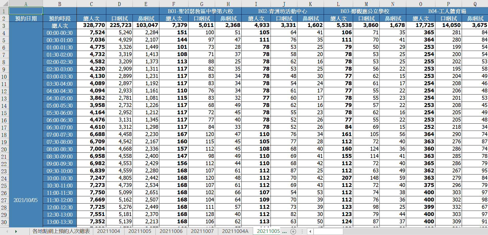

```{r setup, include=FALSE}
knitr::opts_chunk$set(echo = TRUE)
library(lubridate)
library(flux)
library(readxl)
library(reshape)
library(tidyverse)
library(gridExtra)
library(ggmap)
library(plotly)
library(GGally)
library(jsonlite)
```

```{r map-api-key-setup, include=FALSE, message=FALSE, echo = FALSE}
google_map_key <- fromJSON("../../keys.json")$google_map_key
register_google(google_map_key)
ggmap_hide_api_key()
```

## Background  

Under COVID-19 pandemic in 2021, when new imported cases is reported, Macau SAR will launch one round of city-wide nucleic tests to prevent the corona-virus from spreading to local communities.  
This is an exploratory data analysis of Macau's 3rd time city-wide NAT over the period of October 4th 9pm - 7th 9pm.  
This time Macau Government and the Health Bureau has shorten the overall period, targeting to complete process for over 600k citizens within 48 hours.  
(There were 8 locations kept swab station working as usual for continuing after the first 48 hour)  

The questions we seek here are:  
- What time is the most busy time during day?  
- If any location is over stressed or too free?  
- If overall performance is well balanced among each location?  


## Data Sources  
  
1. [City-wide Nucleic Acid Test Booking Stats](https://www.ssm.gov.mo/docs/stat/apt/RNA010.xlsx)  
As the sources claims the "Number of booking will only be counted when it is valid",
therefore the number is treated as the fact number of swab done in our analysis.  
A backup of the data source is available upon requirement:  
[https://github.com/adamzerg/SSM-RNA-Test/blob/main/RNA010/20211004.7z]  

  

2. [Special webpage against Epidemics - Near real-time waiting stats at each swab station location](https://eservice.ssm.gov.mo/aptmon/aptmon/ch)  
The source is refreshed about every 10 minutes, source including number of swab stations by nasal / mouth, locations by category, waiting time.  
A backup of the data source is available upon requirement:  
[https://github.com/adamzerg/SSM-RNA-Test/blob/main/aptmon-scraping/20211004.7z]

  

3. Expected Formula  
Load balance at one location =  
  Source 1：Number of Swab per 30 minutes / Source 2: (Nasal Swab Desks + Mouth Swab Desks)  


## Data Prep  

1. Source 1 is Excel, preparation including  
- Select the latest record only  
- Set a loop to extract information from the specific 4 spreadsheets  
- Pivot for nasal / mouth swab counts based on granularity time (every 30 minutes)  

  

```{r ingest-xlsx-booking, include=FALSE, message=FALSE, echo=FALSE}
filelist2 <- dir('../../RNA010/20211004', full.names=TRUE)
file2 <- tail(filelist2, 1)

sheets <- c("20211004A","20211005A","20211006A","20211007A")
df <- data.frame()
for (sheetname in sheets) {
    #sheetname <- "20211004A"

    ### Extract first row for location list
    cnames <- read_excel(file2, sheet = sheetname, n_max = 0, na = "---") %>% names()
    lls1 <- sub(".*?-", "",cnames[seq(6, length(cnames), 3)])
    ### Extract data from 2nd row
    rdf1 <- read_excel(file2, sheet=sheetname, na = "---", skip = ifelse(sheetname == "20211004A", 2, 1)) # skip 2 because there exists a hidden row 1 in this spreadsheet
    ### Set date
    rdf1$SwabDate <- as.Date(strptime(str_remove(sheetname, "A"),"%Y%m%d"))
    rdf1$SwabTime <- substr(rdf1$預約時段,1,5)
    ### select columns and rows
    sdf1 <- rdf1 %>% select(c(6:ncol(rdf1))) %>% slice(2:nrow(rdf1)) %>% select(-contains("總人次"))
    ### Repeat Location info for number of rows
    Location <- rep(lls1, each = nrow(sdf1) * 2)
    ### Melt to pivot
    sdf1 <- as.data.frame(sdf1)
    mdf1 <- reshape::melt(sdf1, id = c("SwabDate", "SwabTime"))
    ### Combine Location with dataset
    df1 <- cbind(Location,mdf1)
    ### Clean away column names with ...
    df1$variable <- sub("\\....*", "", df1$variable)
    df <- rbind(df,as.data.frame(df1))
}
```


```{r pivot-booking-dataset, include=FALSE, message=FALSE, echo=FALSE}
pdf <- df %>% pivot_wider(names_from = variable, values_from = value)
pdf <- as.data.frame(pdf)
pdf$SwabCount <- rowSums(pdf[ ,c("口咽拭", "鼻咽拭")], na.rm=TRUE)
pdf$DateTimeRound <- as.POSIXlt(paste(pdf$SwabDate, pdf$SwabTime))
attr(pdf$DateTimeRound, "tzone") <- "GMT"
pdf$HourNumber <- 
sapply(strsplit(pdf$SwabTime,":"),
  function(x) {
    x <- as.numeric(x)
    x[1]+x[2]/60
    }
)
pdf <- pdf %>%
  group_by(Location) %>%
  mutate(AvgSwabCount = mean(SwabCount)) %>%
  ungroup() %>%
  mutate(
    DurationHour = as.numeric((DateTimeRound - ymd_hms("2021-10-04 21:00:00")),"hours"),
    DurationDay = as.numeric((DateTimeRound - ymd_hms("2021-10-04 21:00:00")),"days"),
    DurationDayNumber = as.integer(as.numeric((DateTimeRound - ymd_hms("2021-10-04 21:00:00")),"days") + 1)
  )
str(pdf)
```

2. Source 2 is web scraped by setting schedule, preparation including  
- Batch load in once for all scraped histories  
- Add for time format for convenience  

```{r ingest-scraped-dataset, include=FALSE, message=FALSE, echo=FALSE}
filelist <- dir('../../aptmon-scraping/20211004', full.names=TRUE)
scrp <- data.frame()
for (file in filelist) {
    filetimestr <- sub(".csv", "",sub(".*-", "", file))
    filetime <- strptime(filetimestr,"%Y%m%d%H%M%S")
    temp <- read.csv(file, na = "---")
    temp$DateTime <- as.POSIXlt(filetime)
    scrp <- rbind(scrp,as.data.frame(temp))
}
```

```{r trans-scraped-dataset, include=FALSE, message=FALSE, echo=FALSE}
attr(scrp$DateTime, "tzone") <- "GMT"
scrp$DateTimeRound <- round(scrp$DateTime, "30mins")
scrp$WaitingQueue <- as.numeric(as.character(sub("*人", "", scrp$輪候人數)))
scrp$WaitingMinutes <- as.numeric(as.character(sub("分鐘", "",sub(".*>", "", scrp$等候時間))))
scrp$DeskCount <- rowSums(scrp[ ,c("口採樣點", "鼻採樣點")], na.rm=TRUE)
scrp$HourNumber <- 
sapply(strsplit(substr(scrp$DateTimeRound,12,16),":"),
  function(x) {
    x <- as.numeric(x)
    x[1]+x[2]/60
    }
)
str(scrp)
```


## Data Wrangling  

1. Since Source 2 are scraped from near real time, need to:  
- Deduplicate for 30 minutes duration, and determine count / measures with their median value  
- Backfill 3 missing timeframe at Oct-05 6am / 8:30 am / 9am  

```{r mean-station-dataset, include=FALSE, message=FALSE, echo=FALSE}
station <- scrp %>% group_by(序號,Location,類別,DateTimeRound,HourNumber) %>%
      summarise(
            DeskCount.mean = mean(DeskCount, na.rm = TRUE),
            DeskCount.median = median(DeskCount, na.rm = TRUE),
            口採樣點.mean = mean(口採樣點, na.rm = TRUE),
            鼻採樣點.mean = mean(鼻採樣點, na.rm = TRUE),
            口採樣點.median = median(口採樣點, na.rm = TRUE),
            鼻採樣點.median = median(鼻採樣點, na.rm = TRUE),
            WaitingQueue.mean = mean(WaitingQueue, na.rm = TRUE),
            WaitingMinutes.mean = mean(WaitingMinutes, na.rm = TRUE),
            WaitingQueue.median = median(WaitingQueue, na.rm = TRUE),
            WaitingMinutes.median = median(WaitingMinutes, na.rm = TRUE),
      ) %>%
  ungroup() %>%
  as.data.frame()

station <- station %>%
  complete(nesting(Location,序號,類別),
           DateTimeRound = seq.POSIXt(as.POSIXct("2021-10-05 06:00") + hms("08:00:00"),
                                      as.POSIXct("2021-10-05 09:00") + hms("08:00:00"),
                                      by="30 min")
           ) %>%
  filter(!(Location %in% c("綜藝館(免費)", "綜藝館(自費)") &
         DateTimeRound <= as.POSIXct("2021-10-05 09:00") + hms("08:00:00")
         )) %>%
  mutate(HourNumber = hour(DateTimeRound) + minute(DateTimeRound) / 60) %>%
  arrange(Location,DateTimeRound) %>%
  group_by(Location) %>%
  fill(`DeskCount.mean`,`DeskCount.median`,
       `口採樣點.mean`,`鼻採樣點.mean`,`口採樣點.median`,`鼻採樣點.median`,
       `WaitingQueue.mean`,`WaitingMinutes.mean`,`WaitingQueue.median`,`WaitingMinutes.median`) %>%
  mutate(DeskCount.ntile = ntile(DeskCount.mean, 5),
          AvgDeskCount = median(DeskCount.mean)) %>%
  ungroup()

```

2. Extract geolocation information  

```{r trans-lonlat-dataset, include=FALSE, message=FALSE, echo=FALSE}
LonLat <- unique(scrp[c("Location")])
LonLat$MapLoc <- ifelse(LonLat$Location == "科大體育館","Macao, 澳門科技大學室內體育館 Gymnasium",LonLat$Location)
LonLat[grep(".*工人體育場", LonLat$Location, perl=T), ]$MapLoc <- "Macao, 工人體育場館"
LonLat[grep(".*1樓", LonLat$Location, perl=T), ]$MapLoc <- "望廈體育中心 Centro Desportivo Mong-Há"
LonLat <- mutate_geocode(LonLat, MapLoc)
LonLat$area <- ifelse(LonLat$lat>=22.17,'Macao','Taipa')
str(LonLat)
```

3. Merge two sources into one, only category B remains after merged  

```{r binding-dataset, include=FALSE, message=FALSE, echo=FALSE}
ldf <- merge(LonLat, pdf)
mdf <- merge(station, pdf, by = c("Location","DateTimeRound","HourNumber"))
mdf <- mdf %>%
  mutate(
    SwabPerDesk = mdf$SwabCount / ifelse(is.na(mdf$DeskCount.mean) | mdf$DeskCount.mean == 0, 1,
                                              mdf$DeskCount.mean),
    SwabPerDesk.ntile = ntile(SwabPerDesk, 4),
    MouthPerDesk = mdf$口咽拭 / ifelse(is.na(mdf$口採樣點.mean) | mdf$口採樣點.mean == 0 , 1,
                                    mdf$口採樣點.mean),
    NosePerDesk = mdf$鼻咽拭 / ifelse(is.na(mdf$鼻採樣點.mean) | mdf$鼻採樣點.mean == 0, 1,
                                   mdf$鼻採樣點.mean)) %>%
    group_by(Location) %>%
    mutate(AvgSwabPerDesk = mean(SwabPerDesk)) %>%
    ungroup()
  
lldf <- merge(LonLat, mdf)
```


## Preliminary Analysis   

1. Fact Ratios  

- Total bookings is 627,865 from source 1, i.e. Category B (General Station) only  

```{r sum-total, include=FALSE, message=FALSE, echo=FALSE}
sum(pdf$SwabCount,na.rm = TRUE)

```

- The mouth swab total is about 2.3 times than nasal swab  
- Total swab in Macau peninsula is about 2.8 times than Taipa plus Coloane  

```{r base-ratio, warning=FALSE, message=FALSE, echo=FALSE}
options("scipen" = 100, "digits" = 4)

p1 <- df %>% group_by(variable) %>% summarise(value.sum = sum(value, na.rm = TRUE))
p2 <- ldf %>% group_by(area) %>% tally(SwabCount)
rng <- range(0, p1$value.sum, p2$n)

g1 <- ggplot(data=p1, aes(x = variable, y = value.sum, fill = variable)) +
  geom_bar(stat="identity", alpha = .7) + coord_flip(ylim = rng) +
  scale_color_viridis_d(option = 'magma') + scale_fill_viridis_d(option = 'magma') +
  guides(alpha = FALSE) + theme_minimal() +
  xlab("SWab Method") + ylab("Swab Counts")

g2 <- ggplot(data=p2, aes(x = reorder(area,n), y = n, fill = area)) +
  geom_bar(stat="identity", alpha = .7) + coord_flip(ylim = rng) +
  scale_color_viridis_d(option = 'magma') + scale_fill_viridis_d(option = 'magma') +
  guides(alpha = FALSE) + theme_minimal() +
  xlab("Macao / Cotai") + ylab("Swab Counts")

grid.arrange(g1, g2, ncol = 1, top = "Total Swabs by Method / Location Area")
```

2. When time is the most busiest time in a day?  

- Set quartile value based on number of swab per station  

```{r quartile-value, include=FALSE, message=FALSE, echo=FALSE}
tilevalue <- c(max(filter(mdf, SwabPerDesk.ntile == 1)$SwabPerDesk),
max(filter(mdf, SwabPerDesk.ntile == 2)$SwabPerDesk),
max(filter(mdf, SwabPerDesk.ntile == 3)$SwabPerDesk),
max(filter(mdf, SwabPerDesk.ntile == 4)$SwabPerDesk))
tilevalue
```

- The 1st tile has most count overnight, and the 2nd and 3rd mostly appears by daytime  
- Note for the 4th tile, 3 peaks goes to 7am / 1pm / 8pm, each appears for more than 45 times  
- The 3 peak times matched to people's peak working hour during a day  
- Should consider to increase number of stations / swab desks for the specific time frame  

```{r quartile-24hour, warning=FALSE, message=FALSE, echo=FALSE}
fl <- as_labeller(
     c(`1` = "below 27 swap/desk", `2` = "below 33 swap/desk",`3` = "below 42 swap/desk", `4` = "below 122 swap/desk"))

ggplot(mdf, aes(x = HourNumber, fill = factor(DurationDayNumber))) +
  geom_histogram(binwidth = 1, alpha = .7) +
  geom_hline(linetype = "dotted", yintercept = 32, color = "goldenrod") +
  scale_fill_viridis_d(name = "Day", option = 'magma') +
  facet_wrap(~SwabPerDesk.ntile, ncol = 2, labeller = fl) +
  theme_minimal() +
  xlab("24 Hours") + ylab("Counts") +
  ggtitle("Swap per desk in 4-tiles, 24 hours")
```

3. Location stats  

- From total bookings top 5, there are Venetian Cotai Arena, Workers Stadium, Keang Peng Middle School, Kiang Wu Hospital Auditorium, Macao Cultural Centre  
- The distribution appears mostly tend to day 1  

```{r daily-booking-ranking, warning=FALSE, message=FALSE, echo=FALSE}
p3 <- pdf %>% group_by(Location, DurationDayNumber) %>% tally(SwabCount)

ggplot(p3, aes(x = reorder(Location, n), y = n, fill = factor(DurationDayNumber))) +
  geom_bar(stat = "identity", alpha = .7) + coord_flip() +
  scale_fill_viridis_d(name = "Day", option = 'magma') +
  guides(alpha = FALSE) + theme_minimal() +
  ggtitle("Total swabs by location") + xlab("Location") + ylab("Swab Counts")
```

- Number of swab desks varies  
- Outlier can be seen for Worker Stadium, once increased from 10 to 23  
- The adjustment down at Keang Peng Middle School, Kiang Wu Hospital Auditorium  

```{r avgdesk-value, warning=FALSE, message=FALSE, echo=FALSE}
ggplot(mdf, aes(x = reorder(Location, AvgDeskCount), y = DeskCount.mean, fill = AvgDeskCount)) +
  geom_boxplot(alpha = .7) +
  coord_flip() +
  scale_fill_viridis_c(option = 'magma', direction = -1) +
  guides(fill = FALSE, alpha = FALSE) + theme_minimal() +
  ggtitle("Number of swab desk by location") + xlab("Location") + ylab("Number of Swab Desks")

```

4. Station load balance  

```{r prop-heatmap-pivot, include=FALSE, message=FALSE, echo = FALSE}  
prdf <- mdf %>% 
  group_by(Location, DeskCount.ntile) %>% 
  summarise(SwabCountByDesk = sum(SwabCount, na.rm = TRUE)) %>% 
  ungroup() %>%
  group_by(Location) %>%
  mutate(prop = SwabCountByDesk / sum(SwabCountByDesk)) %>%
  ungroup() %>%
  
  select(-SwabCountByDesk) %>%
  pivot_wider(
    id_cols = Location,
    names_from = DeskCount.ntile,
    values_from = prop
  ) %>% 
  mutate(Location = fct_reorder(Location, `5`)) %>%
  pivot_longer(
    cols = -Location,
    names_to = "DeskCount.ntile",
    values_to = "prop"
  )
```

- Sort heatmap on the 5th tile swab count proportion by number of desks  
- The 5tile is set against each location, to number of desks  
- Why for taipa most swab were done at the 5th tile? e.g. Pac On Ferry Terminal, Venetian Cotai Arena, East Asian Games Dome  

```{r prop-heatmap, warning=FALSE, message=FALSE, echo=FALSE}
ggplot(prdf, aes(DeskCount.ntile, Location)) +
  geom_tile(aes(fill = prop), alpha = .7) +
  geom_text(aes(label = scales::percent(prop, accuracy = 1)), size = 3) +
  scale_fill_viridis_c(option = 'magma', direction = -1) +
  guides(fill = FALSE, alpha = FALSE) + theme_minimal() +
  ggtitle("Number Of swabs in proportions by locations") + xlab("Number of Swab Desks in 5-tiles")  + ylab("Location")

```

```{r location-heatmap-dataset, warning=FALSE, message=FALSE, echo=FALSE}
#unique(mdf[c("Location", "AvgSwabPerDesk")]) %>% arrange(-AvgSwabPerDesk)

pldf1 <- mdf[c("Location", "DateTimeRound", "DurationHour","口咽拭", "鼻咽拭")] %>% 
    pivot_longer(
    cols = c("口咽拭", "鼻咽拭"),
    names_to = "variable",
    values_to = "Count"
  )
pldf2 <- mdf[c("Location", "DateTimeRound", "DurationHour","口採樣點.mean","鼻採樣點.mean")] %>% 
    pivot_longer(
    cols = c("口採樣點.mean","鼻採樣點.mean"),
    names_to = "variable",
    values_to = "Count"
  )
pldf <- rbind(pldf1, pldf2) %>%
  mutate(variable = case_when(variable == "口咽拭" ~ "M.Swab Sum",
                              variable == "口採樣點.mean" ~ "M.Swab Desk",
                              variable == "鼻咽拭" ~ "N.Swab Sum",
                              variable == "鼻採樣點.mean" ~ "N.Swab Desk",
                              TRUE ~ "N/A"
                              )) %>%
  arrange(Location, DateTimeRound, DurationHour, variable) %>%
  group_by(Location, variable) %>%
  mutate(prop = Count / sum(Count, na.rm = TRUE)) %>%
  ungroup()
```

- Preview set of 4 stations in Macau over the complete 48 hour (some runs over 48 hr)  
- At Mong-Ha Sports Centre, Keang Peng Middle School, Worker Stadium, no matter which swab method there are increase and decrease adjustment in swab desk along with swab counts  
- Macau Forum however has fluctuated swab counts, but rarely has any adjustment in swab desks  

```{r explore-location-set1, warning=FALSE, message=FALSE, echo=FALSE}
s1 <- c("綜藝館(免費)","鏡平學校（中學部）","望廈體育中心1樓","工人體育場")

sh1 <- filter(pldf, Location %in% s1) %>%
  ggplot(aes(DateTimeRound, variable)) +
  geom_tile(aes(fill = prop), alpha = .8) +
  scale_fill_viridis_c(option = 'magma', direction = -1) +
  facet_wrap(~Location, ncol = 1) +
  guides(fill = FALSE, alpha = FALSE) + theme_minimal() +
  xlab("") + ylab("Number proportion")

sb1 <- filter(mdf, Location %in% s1) %>% 
  ggplot(aes(x = DateTimeRound, y = SwabPerDesk, fill = SwabPerDesk)) +
  geom_bar(stat = "identity", alpha = .8) +
  geom_hline(linetype = "dotted", aes(yintercept = AvgSwabPerDesk), color = "goldenrod") +
  scale_fill_viridis_c(option = 'magma', direction = -1) +
  facet_wrap(~Location, ncol = 1) +
  guides(fill = FALSE, alpha = FALSE) + theme_minimal() +
  xlab("") + ylab("Swabs per desk")

grid.arrange(sh1, sb1, nrow = 1, top = "Set of 4 locations from Macao area in 3 days")
```

- Preview set of 4 stations in Taipa over the complete 48 hour (some runs over 48 hr)  
- There are darker and lighter intervals one after each in number of swab desks vs swab done, means they were not in a consist ratio  
- Some spikes appears for Venetian Cotai Arena and East Asian Games Dome but in different time frame, could consider supporting each other in due time  
- The 2nd day overall has less stressed than the 1st in Taipa, which explained why the distribution appears mostly tend to be in day 1, should consider for supporting Macau, or make redirection for the crowd go Taipa by day 2  

```{r explore-location-set2, warning=FALSE, message=FALSE, echo=FALSE}
s2 <- c("北安客運碼頭","澳門威尼斯人","澳門東亞運體育館A館","奧林匹克體育中心-運動場-室內體育館")

sh2 <- filter(pldf, Location %in% s2) %>%
  ggplot(aes(DateTimeRound, variable)) +
  geom_tile(aes(fill = prop), alpha = .8) +
  scale_fill_viridis_c(option = 'magma', direction = -1) +
  facet_wrap(~Location, ncol = 1) +
  guides(fill = FALSE, alpha = FALSE) + theme_minimal() +
  xlab("") + ylab("Number proportion")

sb2 <- filter(mdf, Location %in% s2) %>% 
  ggplot(aes(x = DateTimeRound, y = SwabPerDesk, fill = SwabPerDesk)) +
  geom_bar(stat = "identity", alpha = .8) +
  geom_hline(linetype = "dotted", aes(yintercept = AvgSwabPerDesk), color = "goldenrod") +
  scale_fill_viridis_c(option = 'magma', direction = -1) +
  facet_wrap(~Location, ncol = 1) +
  guides(fill = FALSE, alpha = FALSE) + theme_minimal() +
  xlab("") + ylab("Swabs per desk")

grid.arrange(sh2, sb2, nrow = 1, top = "Set of 4 locations from Cotai area in 3 days")
```

5. Map  

- An animation for the 4th quartile swab per desk to each location within 48 hours  
- Bubble size representing swab per desk  
- Reflecting well the peak time by the 10th / 16th hour (Oct-06 7am / 1pm)  
- The 31st -36th hour crowd appears only in Macau peninsula (Oct-07 4am - 9am)  
- A notable crowd appears right by the 47th hour (Oct-07 8pm)  

```{r lonlat-ggplotly-set1, warning=FALSE, message=FALSE, echo=FALSE}
p4 <- lldf %>% filter(SwabPerDesk.ntile == 4)

plot <- ggmap(get_map(location = "taipa, macao", zoom = 12), darken = .5, 
base_layer = ggplot(data = p4, aes(x = lon, y = lat, frame = DurationHour, ids = Location))) +
geom_point(data = p4, aes(color = SwabPerDesk, size = SwabPerDesk, alpha = .5)) +
scale_size(range = c(0, 12)) +
scale_color_viridis_c(option = "magma")

ggplotly(plot)
```


By Venetian Cotai Arena, 2nd day is less stressed comparing to the 1st day  

  

There are about 20 swab desks, by 2nd day noon only 5-6 is operating and there is nearly no waiting queue  

  


## Summary  
- We can use Swab per desk by every 30 minutes as a measure to review the load balance to each station, ideally this number is under 33  
- Potential improvement can be made, if we can increase the swab desks in station during peak rush hours  
- Relocating more / less staff depending on the next hour booking numbers  
- Limit for number of bookings for an upcoming time in case if shortage, also avoid relocation of staffs  


## Reference
[8個常規核酸檢測站在全民核酸檢測結束後將重新開放並延長服務時間](https://www.ssm.gov.mo/docs/20257/20257_113648d57b4a4aa3b1cc4265ec112902_000.pdf)  
[今(4)日晚上9時至10月7日晚上9時進行第三次全民核酸檢測](https://www.ssm.gov.mo/docs/20291/20291_f2153a77511c40619660cc7c7764a661_000.pdf)  
[第 3 次較第 2 次全民核檢首 3 小時採樣人數多 各個採樣站點的輪候情況理想](https://www.ssm.gov.mo/docs/file/20318/)  


  


