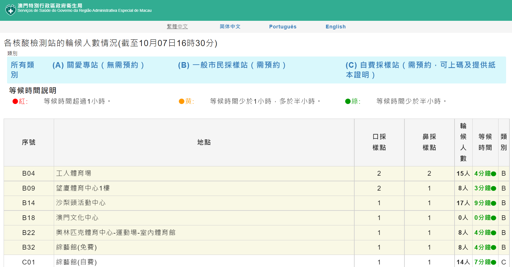

```{r setup, include=FALSE}
knitr::opts_chunk$set(echo = TRUE)
library(lubridate)
library(flux)
library(readxl)
library(reshape)
library(tidyverse)
library(gridExtra)
library(ggmap)
library(plotly)
library(GGally)
```

```{r map-api-key-setup, include=FALSE, message=FALSE, echo = FALSE}
google_map_key <- fromJSON("keys.json")$google_map_key
register_google(google_map_key)
ggmap_hide_api_key()
```


## 概覽  

關於澳門第三次全民核酸的初步分析，核酸檢測時間為2021年10月4日9pm -7日9pm  
因第二次全民核酸已得顯著改善，故第三次核酸的安排鼓勵縮短整體時間至兩日內  
（第三日僅開放部分八個檢測點以延續正常檢測工作）  
這裡的分析主要聚焦看前兩日內的各站點壓力表現  
以每採樣站每採樣點平均半小時採樣數做主要表達  

主要想了解，在整體時間縮短至兩日內的情況下，各站點整體是否負載均衡  
是否有壓力過高或過低的時段可以改善  


## 數據來源  
  
1. [網上預約全民核酸檢測人次](https://www.ssm.gov.mo/docs/stat/apt/RNA010.xlsx)  
來源聲明“截至執行時間為止仍然有效的網上預約全民核酸檢測人次統計”
這裡的分析且作歷史事實即預約數作實際採樣測驗數看待  
因非全民核酸期間官方網頁關閉，如需重現分析數據可以於這裡下載  
[https://github.com/adamzerg/SSM-RNA-Test/blob/main/RNA010/20211004.7z]  

  

2. [澳門抗疫專頁 - 各核酸檢測站的輪候人數情況](https://eservice.ssm.gov.mo/aptmon/aptmon/ch)  
來源準即時刷新（約為每十分鐘），主要取用採樣點數目作參考  
因非全民核酸期間官方網頁關閉，如需重現分析數據可以於這裡下載  
[https://github.com/adamzerg/SSM-RNA-Test/blob/main/aptmon-scraping/20211004.7z]

  

3. 公式
採樣站的負荷 = 來源1：該採樣站每半小時檢測數 / 來源2：(口採樣點 + 鼻採樣點)  


## 數據準備  

1. 來源1是預約歷史交易型的Excel，準備工作包括  
- 選取最後一次歷史記載  
- 在Excel獨立分頁上循環抽取三日(四分頁)信息  

  

```{r ingest-xlsx-booking, message=FALSE}
filelist2 <- dir('../../RNA010/20211004', full.names=TRUE)
file2 <- tail(filelist2, 1)

sheets <- c("20211004A","20211005A","20211006A","20211007A")
df <- data.frame()
for (sheetname in sheets) {
    #sheetname <- "20211004A"

    ### Extract first row for location list
    cnames <- read_excel(file2, sheet = sheetname, n_max = 0, na = "---") %>% names()
    lls1 <- sub(".*?-", "",cnames[seq(6, length(cnames), 3)])
    ### Extract data from 2nd row
    rdf1 <- read_excel(file2, sheet=sheetname, na = "---", skip = ifelse(sheetname == "20211004A", 2, 1)) # skip 2 because there exists a hidden row 1 in this spreadsheet
    ### Set date
    rdf1$SwabDate <- as.Date(strptime(str_remove(sheetname, "A"),"%Y%m%d"))
    rdf1$SwabTime <- substr(rdf1$預約時段,1,5)
    ### select columns and rows
    sdf1 <- rdf1 %>% select(c(6:ncol(rdf1))) %>% slice(2:nrow(rdf1)) %>% select(-contains("總人次"))
    ### Repeat Location info for number of rows
    Location <- rep(lls1, each = nrow(sdf1) * 2)
    ### Melt to pivot
    sdf1 <- as.data.frame(sdf1)
    mdf1 <- reshape::melt(sdf1, id = c("SwabDate", "SwabTime"))
    ### Combine Location with dataset
    df1 <- cbind(Location,mdf1)
    ### Clean away column names with ...
    df1$variable <- sub("\\....*", "", df1$variable)
    df <- rbind(df,as.data.frame(df1))
}
```

- 根據時間粒度(每半小時)轉化旋轉採樣數  
```{r pivot-booking-dataset}
pdf <- df %>% pivot_wider(names_from = variable, values_from = value)
pdf <- as.data.frame(pdf)
pdf$SwabCount <- rowSums(pdf[ ,c("口咽拭", "鼻咽拭")], na.rm=TRUE)
pdf$DateTimeRound <- as.POSIXlt(paste(pdf$SwabDate, pdf$SwabTime))
attr(pdf$DateTimeRound, "tzone") <- "GMT"
pdf$HourNumber <- 
sapply(strsplit(pdf$SwabTime,":"),
  function(x) {
    x <- as.numeric(x)
    x[1]+x[2]/60
    }
)
pdf <- pdf %>%
  group_by(Location) %>%
  mutate(AvgSwabCount = mean(SwabCount)) %>%
  ungroup() %>%
  mutate(
    DurationHour = as.numeric((DateTimeRound - ymd_hms("2021-10-04 21:00:00")),"hours"),
    DurationDay = as.numeric((DateTimeRound - ymd_hms("2021-10-04 21:00:00")),"days"),
    DurationDayNumber = as.integer(as.numeric((DateTimeRound - ymd_hms("2021-10-04 21:00:00")),"days") + 1)
  )
str(pdf)
```

2. 來源2是準實時刷新抓取頁面容器內的表標記，準備工作包括
- 讀取所有源數據  

```{r ingest-scraped-dataset, message=FALSE}
filelist <- dir('../../aptmon-scraping/20211004', full.names=TRUE)
scrp <- data.frame()
for (file in filelist) {
    filetimestr <- sub(".csv", "",sub(".*-", "", file))
    filetime <- strptime(filetimestr,"%Y%m%d%H%M%S")
    temp <- read.csv(file, na = "---")
    temp$DateTime <- as.POSIXlt(filetime)
    scrp <- rbind(scrp,as.data.frame(temp))
}
```

- 清洗轉化時間/人數/分鐘的格式  

```{r trans-scraped-dataset, message=FALSE, warning=FALSE, error=FALSE}
attr(scrp$DateTime, "tzone") <- "GMT"
scrp$DateTimeRound <- round(scrp$DateTime, "30mins")
scrp$WaitingQueue <- as.numeric(as.character(sub("*人", "", scrp$輪候人數)))
scrp$WaitingMinutes <- as.numeric(as.character(sub("分鐘", "",sub(".*>", "", scrp$等候時間))))
scrp$DeskCount <- rowSums(scrp[ ,c("口採樣點", "鼻採樣點")], na.rm=TRUE)
scrp$HourNumber <- 
sapply(strsplit(substr(scrp$DateTimeRound,12,16),":"),
  function(x) {
    x <- as.numeric(x)
    x[1]+x[2]/60
    }
)
str(scrp)
```


## 數據整合  

1. 來源2為準實時抓取，需要去重同時找平均數/中位數  
- 有三個時間點因抓取的技術問題缺失，分別為 10-05 6am / 8:30 am / 9am  
- 這裡的修復僅取前一個值做填補  

```{r mean-station-dataset, message=FALSE}  
station <- scrp %>% group_by(序號,Location,類別,DateTimeRound,HourNumber) %>%
      summarise(
            DeskCount.mean = mean(DeskCount, na.rm = TRUE),
            DeskCount.median = median(DeskCount, na.rm = TRUE),
            口採樣點.mean = mean(口採樣點, na.rm = TRUE),
            鼻採樣點.mean = mean(鼻採樣點, na.rm = TRUE),
            口採樣點.median = median(口採樣點, na.rm = TRUE),
            鼻採樣點.median = median(鼻採樣點, na.rm = TRUE),
            WaitingQueue.mean = mean(WaitingQueue, na.rm = TRUE),
            WaitingMinutes.mean = mean(WaitingMinutes, na.rm = TRUE),
            WaitingQueue.median = median(WaitingQueue, na.rm = TRUE),
            WaitingMinutes.median = median(WaitingMinutes, na.rm = TRUE),
      ) %>%
  ungroup() %>%
  as.data.frame()

station <- station %>%
  complete(nesting(Location,序號,類別),
           DateTimeRound = seq.POSIXt(as.POSIXct("2021-10-05 06:00") + hms("08:00:00"),
                                      as.POSIXct("2021-10-05 09:00") + hms("08:00:00"),
                                      by="30 min")
           ) %>%
  filter(!(Location %in% c("綜藝館(免費)", "綜藝館(自費)") &
         DateTimeRound <= as.POSIXct("2021-10-05 09:00") + hms("08:00:00")
         )) %>%
  mutate(HourNumber = hour(DateTimeRound) + minute(DateTimeRound) / 60) %>%
  arrange(Location,DateTimeRound) %>%
  group_by(Location) %>%
  fill(`DeskCount.mean`,`DeskCount.median`,
       `口採樣點.mean`,`鼻採樣點.mean`,`口採樣點.median`,`鼻採樣點.median`,
       `WaitingQueue.mean`,`WaitingMinutes.mean`,`WaitingQueue.median`,`WaitingMinutes.median`) %>%
  mutate(DeskCount.ntile = ntile(DeskCount.mean, 5),
          AvgDeskCount = median(DeskCount.mean)) %>%
  ungroup()

```

2. 來源2內可以進一步提取地點信息取坐標，結合作地圖定位  
```{r trans-lonlat-dataset, message=FALSE}
LonLat <- unique(scrp[c("Location")])
LonLat$MapLoc <- ifelse(LonLat$Location == "科大體育館","Macao, 澳門科技大學室內體育館 Gymnasium",LonLat$Location)
LonLat[grep(".*工人體育場", LonLat$Location, perl=T), ]$MapLoc <- "Macao, 工人體育場館"
LonLat[grep(".*1樓", LonLat$Location, perl=T), ]$MapLoc <- "望廈體育中心 Centro Desportivo Mong-Há"
LonLat <- mutate_geocode(LonLat, MapLoc)
LonLat$area <- ifelse(LonLat$lat>=22.17,'Macao','Taipa')
str(LonLat)
```

3. 將來源2的採樣站和地點坐標，與來源1連接合併作一個數據集，需留意來源1僅包含自B類採樣站，故合併後的數據集僅存有B類採樣站  

```{r binding-dataset}  
ldf <- merge(LonLat, pdf)
mdf <- merge(station, pdf, by = c("Location","DateTimeRound","HourNumber"))
mdf <- mdf %>%
  mutate(
    SwabPerDesk = mdf$SwabCount / ifelse(is.na(mdf$DeskCount.mean) | mdf$DeskCount.mean == 0, 1,
                                              mdf$DeskCount.mean),
    SwabPerDesk.ntile = ntile(SwabPerDesk, 4),
    MouthPerDesk = mdf$口咽拭 / ifelse(is.na(mdf$口採樣點.mean) | mdf$口採樣點.mean == 0 , 1,
                                    mdf$口採樣點.mean),
    NosePerDesk = mdf$鼻咽拭 / ifelse(is.na(mdf$鼻採樣點.mean) | mdf$鼻採樣點.mean == 0, 1,
                                   mdf$鼻採樣點.mean)) %>%
    group_by(Location) %>%
    mutate(AvgSwabPerDesk = mean(SwabPerDesk)) %>%
    ungroup()
  
lldf <- merge(LonLat, mdf)
```


## 初步分析  

1. 基本比例  

- 來源1內的總預約數(僅B類別)  
```{r sum-total}  
sum(pdf$SwabCount,na.rm = TRUE)

```

- 口咽拭約為鼻咽拭的2.3倍  
- 澳門半島的預約總和約為氹仔路環區的2.8倍  

```{r base-ratio, warning=FALSE, message=FALSE}  
options("scipen" = 100, "digits" = 4)

p1 <- df %>% group_by(variable) %>% summarise(value.sum = sum(value, na.rm = TRUE))
p2 <- ldf %>% group_by(area) %>% tally(SwabCount)
rng <- range(0, p1$value.sum, p2$n)

g1 <- ggplot(data=p1, aes(x = variable, y = value.sum, fill = variable)) +
  geom_bar(stat="identity", alpha = .7) + coord_flip(ylim = rng) +
  scale_color_viridis_d(option = 'magma') + scale_fill_viridis_d(option = 'magma') +
  guides(alpha = FALSE) + theme_minimal() +
  xlab("SWab Method") + ylab("Swab Counts")

g2 <- ggplot(data=p2, aes(x = reorder(area,n), y = n, fill = area)) +
  geom_bar(stat="identity", alpha = .7) + coord_flip(ylim = rng) +
  scale_color_viridis_d(option = 'magma') + scale_fill_viridis_d(option = 'magma') +
  guides(alpha = FALSE) + theme_minimal() +
  xlab("Macao / Cotai") + ylab("Swab Counts")

grid.arrange(g1, g2, ncol = 1, top = "Total Swabs by Method / Location Area")
```

2. 24時的四分位分佈  

- 四分位設於每採樣點半小時檢測數，四分位值為  

```{r quartile-value}  
tilevalue <- c(max(filter(mdf, SwabPerDesk.ntile == 1)$SwabPerDesk),
max(filter(mdf, SwabPerDesk.ntile == 2)$SwabPerDesk),
max(filter(mdf, SwabPerDesk.ntile == 3)$SwabPerDesk),
max(filter(mdf, SwabPerDesk.ntile == 4)$SwabPerDesk))
tilevalue
```

- 一分位趨與夜間，二三分位相較平均在日間  
- 值得留意四分位有三個高位在 7am / 1pm / 8pm，出現45次以上  
- 該三個高位繁忙時段具日間作息代表性，或可考慮按時段需求增設檢測點  

```{r quartile-24hour, warning=FALSE, message=FALSE}  
fl <- as_labeller(
     c(`1` = "below 27 swap/desk", `2` = "below 33 swap/desk",`3` = "below 42 swap/desk", `4` = "below 122 swap/desk"))

ggplot(mdf, aes(x = HourNumber, fill = factor(DurationDayNumber))) +
  geom_histogram(binwidth = 1, alpha = .7) +
  geom_hline(linetype = "dotted", yintercept = 32, color = "goldenrod") +
  scale_fill_viridis_d(name = "Day", option = 'magma') +
  facet_wrap(~SwabPerDesk.ntile, ncol = 2, labeller = fl) +
  theme_minimal() +
  xlab("24 Hours") + ylab("Counts") +
  ggtitle("Swap per desk in 4-tiles, 24 hours")
```

3. 採樣站  

- 預約排名前置有威尼斯人,工人體育場,鏡平,鏡湖,文化中心
- 單日分佈預約均聚集於10月5日  

```{r daily-booking-ranking, warning=FALSE, message=FALSE}  
p3 <- pdf %>% group_by(Location, DurationDayNumber) %>% tally(SwabCount)

ggplot(p3, aes(x = reorder(Location, n), y = n, fill = factor(DurationDayNumber))) +
  geom_bar(stat = "identity", alpha = .7) + coord_flip() +
  scale_fill_viridis_d(name = "Day", option = 'magma') +
  guides(alpha = FALSE) + theme_minimal() +
  ggtitle("Total swabs by location") + xlab("Location") + ylab("Swab Counts")
```

- 各站點採樣點的數量變化  
- 有高離群值出現在工人體育場10個增至23個，健康生活教育園地6個增至13個  
- 同時可見鏡平及鏡湖偶有向下調整  

```{r avgdesk-value, warning=FALSE, message=FALSE}  

ggplot(mdf, aes(x = reorder(Location, AvgDeskCount), y = DeskCount.mean, fill = AvgDeskCount)) +
  geom_boxplot(alpha = .7) +
  coord_flip() +
  scale_fill_viridis_c(option = 'magma', direction = -1) +
  guides(fill = FALSE, alpha = FALSE) + theme_minimal() +
  ggtitle("Number of swab desk by location") + xlab("Location") + ylab("Number of Swab Desks")

```

4. 採樣站負載  
- 採樣站五分位熱圖轉化準備  

```{r prop-heatmap-pivot}  
prdf <- mdf %>% 
  group_by(Location, DeskCount.ntile) %>% 
  summarise(SwabCountByDesk = sum(SwabCount, na.rm = TRUE)) %>% 
  ungroup() %>%
  group_by(Location) %>%
  mutate(prop = SwabCountByDesk / sum(SwabCountByDesk)) %>%
  ungroup() %>%
  
  select(-SwabCountByDesk) %>%
  pivot_wider(
    id_cols = Location,
    names_from = DeskCount.ntile,
    values_from = prop
  ) %>% 
  mutate(Location = fct_reorder(Location, `5`)) %>%
  pivot_longer(
    cols = -Location,
    names_to = "DeskCount.ntile",
    values_to = "prop"
  )
```

- 依各站自身採樣點歸五分位後排列熱圖  
- 氹仔採樣數多趨於高分位採樣點完成，例北安碼頭，威尼斯人，東亞運  

```{r prop-heatmap, warning=FALSE, message=FALSE}  
ggplot(prdf, aes(DeskCount.ntile, Location)) +
  geom_tile(aes(fill = prop), alpha = .7) +
  geom_text(aes(label = scales::percent(prop, accuracy = 1)), size = 3) +
  scale_fill_viridis_c(option = 'magma', direction = -1) +
  guides(fill = FALSE, alpha = FALSE) + theme_minimal() +
  ggtitle("Number Of swabs in proportions by locations") + xlab("Number of Swab Desks in 5-tiles")  + ylab("Location")

```

- 採樣站五分位熱圖轉化準備2  

```{r location-heatmap-dataset}  
#unique(mdf[c("Location", "AvgSwabPerDesk")]) %>% arrange(-AvgSwabPerDesk)

pldf1 <- mdf[c("Location", "DateTimeRound", "DurationHour","口咽拭", "鼻咽拭")] %>% 
    pivot_longer(
    cols = c("口咽拭", "鼻咽拭"),
    names_to = "variable",
    values_to = "Count"
  )
pldf2 <- mdf[c("Location", "DateTimeRound", "DurationHour","口採樣點.mean","鼻採樣點.mean")] %>% 
    pivot_longer(
    cols = c("口採樣點.mean","鼻採樣點.mean"),
    names_to = "variable",
    values_to = "Count"
  )
pldf <- rbind(pldf1, pldf2) %>%
  mutate(variable = case_when(variable == "口咽拭" ~ "M.Swab Sum",
                              variable == "口採樣點.mean" ~ "M.Swab Desk",
                              variable == "鼻咽拭" ~ "N.Swab Sum",
                              variable == "鼻採樣點.mean" ~ "N.Swab Desk",
                              TRUE ~ "N/A"
                              )) %>%
  arrange(Location, DateTimeRound, DurationHour, variable) %>%
  group_by(Location, variable) %>%
  mutate(prop = Count / sum(Count, na.rm = TRUE)) %>%
  ungroup()
```

- 選擇採樣站，看完整二日的採樣表現（部分站點有三日）  
- 第一組澳門採樣站，前三個站點表現平穩，
- 不論拭子採樣方式，均有增減大致符合檢測數變動
- 綜藝館波幅變動大受壓明顯，但採樣枱數並無合理調整  

```{r explore-location-set1, warning=FALSE, message=FALSE}  
s1 <- c("綜藝館(免費)","鏡平學校（中學部）","望廈體育中心1樓","工人體育場")

sh1 <- filter(pldf, Location %in% s1) %>%
  ggplot(aes(DateTimeRound, variable)) +
  geom_tile(aes(fill = prop), alpha = .8) +
  scale_fill_viridis_c(option = 'magma', direction = -1) +
  facet_wrap(~Location, ncol = 1) +
  guides(fill = FALSE, alpha = FALSE) + theme_minimal() +
  xlab("") + ylab("Number proportion")

sb1 <- filter(mdf, Location %in% s1) %>% 
  ggplot(aes(x = DateTimeRound, y = SwabPerDesk, fill = SwabPerDesk)) +
  geom_bar(stat = "identity", alpha = .8) +
  geom_hline(linetype = "dotted", aes(yintercept = AvgSwabPerDesk), color = "goldenrod") +
  scale_fill_viridis_c(option = 'magma', direction = -1) +
  facet_wrap(~Location, ncol = 1) +
  guides(fill = FALSE, alpha = FALSE) + theme_minimal() +
  xlab("") + ylab("Swabs per desk")

grid.arrange(sh1, sb1, nrow = 1, top = "Set of 4 locations from Macao area in 3 days")
```

- 第二組四氹仔採樣站  
- 深淺間隔代表檢測數和測試站不等比偶有發生，需加留意  
- 威尼斯人及東亞運可見激增高峰位但不同時段，或可考慮應急資源置換  
- 氹仔整體而言第二日較第一日無壓力，亦解答為何氹仔採樣數多趨於高分位採樣點完成
- 或可考慮在澳門半島做引流需要  

```{r explore-location-set2, warning=FALSE, message=FALSE}  
s2 <- c("北安客運碼頭","澳門威尼斯人","澳門東亞運體育館A館","奧林匹克體育中心-運動場-室內體育館")

sh2 <- filter(pldf, Location %in% s2) %>%
  ggplot(aes(DateTimeRound, variable)) +
  geom_tile(aes(fill = prop), alpha = .8) +
  scale_fill_viridis_c(option = 'magma', direction = -1) +
  facet_wrap(~Location, ncol = 1) +
  guides(fill = FALSE, alpha = FALSE) + theme_minimal() +
  xlab("") + ylab("Number proportion")

sb2 <- filter(mdf, Location %in% s2) %>% 
  ggplot(aes(x = DateTimeRound, y = SwabPerDesk, fill = SwabPerDesk)) +
  geom_bar(stat = "identity", alpha = .8) +
  geom_hline(linetype = "dotted", aes(yintercept = AvgSwabPerDesk), color = "goldenrod") +
  scale_fill_viridis_c(option = 'magma', direction = -1) +
  facet_wrap(~Location, ncol = 1) +
  guides(fill = FALSE, alpha = FALSE) + theme_minimal() +
  xlab("") + ylab("Swabs per desk")

grid.arrange(sh2, sb2, nrow = 1, top = "Set of 4 locations from Cotai area in 3 days")
```

5. 地圖動態  

- 48小時內各採樣點採樣數的動態分佈  
- 泡泡的大小為每採樣點採樣數動態僅取第四分位
- 基本反映前两个個高位第 10 / 16 小時（10月6日 7am / 1pm）  
- 第31-36小時反映高位偏聚集澳门半岛（10月7日 4am -9am）   
- 第47小時（10月7日8pm）出現最後一高位  

```{r lonlat-ggplotly-set1, warning=FALSE, message=FALSE}  
p4 <- lldf %>% filter(SwabPerDesk.ntile == 4)

plot <- ggmap(get_map(location = "taipa, macao", zoom = 12), darken = .5, 
base_layer = ggplot(data = p4, aes(x = lon, y = lat, frame = DurationHour, ids = Location))) +
geom_point(data = p4, aes(color = SwabPerDesk, size = SwabPerDesk, alpha = .5)) +
scale_size(range = c(0, 12)) +
scale_color_viridis_c(option = "magma")

ggplotly(plot)
```


威尼斯人採樣站點第二日實景，較第一日為空閒  

  

預設約20採樣點，於第二日中午調整至僅需開放 5-6 採樣點供基本均無需等待  

  

## 總結  
- 採樣站的負荷即單點採樣數可作為指標參考每個站點的負載均衡,均數33以下較理想   
- 相應可以做的改善包括作息需求可以針對24小時均衡做調度調整
- 已知預約數情況下做測試點採樣點的人員調度以保證均衡
- 動態控制各站點可預約數以減少人員及其他資源的調度


## 其他  
- 將來源2的即時等待人數和等待時間放到來源1預約數和單採樣站點採樣數內做配對  
- 每採樣站採樣數的四分位作顏色標籤  
- 散點圖中隊伍等待人數和等待時間相關性0.797，預約數和單採樣站點數相關性0.773  
- 該兩配對的四分位標籤的分佈情況大致符合，即單點採樣數與即時等待人數和時間基本正比


```{r pairs-waiting}  
ggpairs(mdf[c("WaitingQueue.mean","WaitingMinutes.mean","SwabCount","DeskCount.mean")], 
        aes(color = factor(mdf$SwabPerDesk.ntile), alpha = .3))
```


## 更多資料參考  
[8個常規核酸檢測站在全民核酸檢測結束後將重新開放並延長服務時間](https://www.ssm.gov.mo/docs/20257/20257_113648d57b4a4aa3b1cc4265ec112902_000.pdf)  
[今(4)日晚上9時至10月7日晚上9時進行第三次全民核酸檢測](https://www.ssm.gov.mo/docs/20291/20291_f2153a77511c40619660cc7c7764a661_000.pdf)  
[第 3 次較第 2 次全民核檢首 3 小時採樣人數多 各個採樣站點的輪候情況理想](https://www.ssm.gov.mo/docs/file/20318/)  


  
